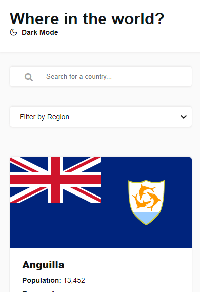
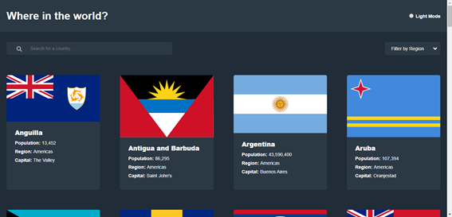
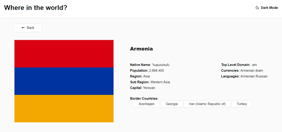
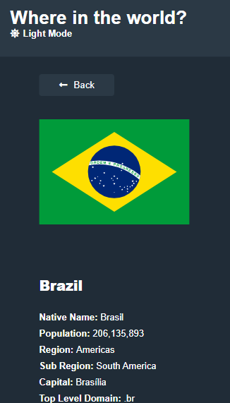

# Frontend Mentor - REST Countries API with color theme switcher

# Page's style

 

 

 

 

# Skills practiced
* Fetching content from API using javascript
* Filtering data coming from API requests
* Dark mode switching
* Classes on javascript
* Modules on javascript
* HTML5 Web Storage
* GIT use for version control

# This was my first ever challenge on front-end mentor, I finished this project in 4 days, from 31/05/2021 to 03/06/2021, I didn't expect to make this to end that quick, as this challenge is considered an advanced level project, but I think I did well, at least for the first time 🤷‍♂️

*[My Website](https://meu-portfolio-izui59udw-romario-negreiros.vercel.app)

